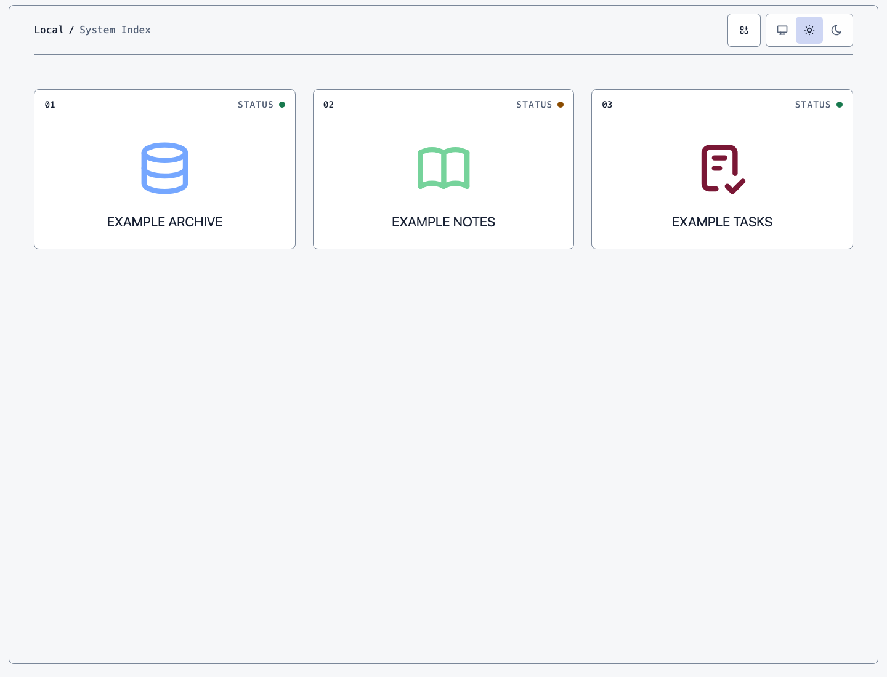
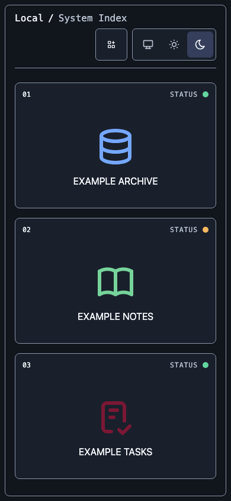

# Local Web Server

Local Web is a macOS framework for turning independent application repositories
into a coherent private web catalogue. It builds immutable releases, generates
Caddy and LaunchAgent configuration, supervises local services, applies shared
UI/security contracts, and provides preview-first recovery tooling—without
making the application repositories part of one monolith.

The project is open source under the MIT licence. The npm workspace remains
`private: true`; this repository is not an npm package release.

## Architecture

```text
app repositories + local-web.json
              |
              v
      Local Web build/validation
              |
     immutable releases + services
              |
browser -> Caddy -> static files / loopback service APIs
              |
        System Index + shared theme
```

The framework owns host ingress, the private host profile and revision chain,
generated configuration, release switching, health gates, app bootstrap, shared
UI primitives, context downloads, and optional interactive-export packaging.
Each app owns its domain code, manifest, durable data, environment values,
authorization, export payload semantics, and app-local tests.

The canonical host profile is ignored at `config/local/apps.json`. It is never
replaced by the public example when missing. The generated runtime is disposable;
private profile history and application data are not.

See [the architecture guide](docs/architecture.md) for component and trust
boundaries.

## Screenshots

The pinned System Index fixtures use fictional applications while exercising
the same catalogue, status, colour-mode, and responsive-layout contracts as a
real host.





## Prerequisites

- macOS with a logged-in user account (services are user LaunchAgents);
- Git and Python 3;
- Node.js and npm in a version range declared by `package.json` for shared UI,
  app generation, and browser verification;
- Caddy 2; and
- optionally, externally managed Tailscale when using HTTPS ingress.

Install framework development dependencies without package lifecycle scripts:

```sh
npm ci --ignore-scripts
./node_modules/.bin/playwright install chromium
```

## Bootstrap a host

Choose one host registry shape and prepare it outside the tracked tree. Use
`config/apps.example.json` as documentation, not as live state. A new host can
start with an empty `apps` list and register applications later.

Trusted-LAN HTTP (schema version 1):

```json
{
  "schemaVersion": 1,
  "host": "local-web.local",
  "runtimeRoot": "/Users/example/Coding/runtime",
  "apps": []
}
```

Tailscale Serve HTTPS (schema version 2):

```json
{
  "schemaVersion": 2,
  "publicOrigin": "https://local.example.ts.net",
  "ingressMode": "tailscale-serve",
  "runtimeRoot": "/Users/example/Coding/runtime",
  "apps": []
}
```

The version-2 origin must be an exact lowercase
`https://<device>.<tailnet>.ts.net` value with no port, credentials, path, query,
fragment, trailing dot/slash, whitespace, backslash, or percent encoding.
Tailscale must already be configured; Local Web does not administer it.

Make the prepared file mode `0600`, preview initialization, then apply only
after reviewing the digest and destination:

```sh
bin/local-web host init --from /Users/example/Coding/prepared-local-web-host.json
bin/local-web host init --from /Users/example/Coding/prepared-local-web-host.json --apply
bin/local-web host status
```

Preview installation next:

```sh
python3 scripts/install_local_web.py --dry-run
```

Review the would-change summary and obtain separate approval before applying:

```sh
python3 scripts/install_local_web.py
```

The plain invocation is the installer apply; there is no `--apply` flag. It
changes generated runtime/LaunchAgent state. Read
[private host-profile operations](docs/operations/host-profile.md) and the
[recovery runbook](docs/operations/recovery.md) first.

## Create an application

Resolve the repository CLI, search the identity catalogue, then create a static
app (the default) or an explicit service app:

```sh
bin/local-web app identity --search "notes journal"
bin/local-web app create example-notes \
  --title "Example Notes" --icon book --accent '#3859D6'

bin/local-web app create example-service \
  --title "Example Service" --icon database --accent '#00796B' --kind service
```

The generator creates a React/Vite foundation with the shared shell, manifest,
context-export adapter, local checks, browser tests, and vendored UI package.
From the new repository:

```sh
bin/local-web app doctor --repository .
npm run check
npm run test:e2e
bin/local-web app check --repository .
bin/local-web app activate --repository .
```

Activation preview is read-only. Its `--apply` form registers, installs, deploys,
and verifies the app and therefore needs a separate live decision. Do not choose
a service port or edit the private profile, Caddyfile, LaunchAgent, or release
pointer by hand.

### Application manifest

Every app commits `local-web.json` with:

- `schemaVersion: 1`;
- stable lowercase `id`, visible `title`, and route without a trailing slash;
- `kind: "static"` or `"service"`;
- direct-argument `build.commands`, relative `build.output`, and explicit
  `build.environment` names;
- a public `healthPath`; and
- an intentional `home` icon/accent plus optional platform provenance.

Service apps add a `service` object with `module` and loopback
`internalHealthPath`. A split service supplies `frontendOutput` and non-empty
`proxyPaths` together. `build.release` can compose exact frontend, server, and
immutable-data sources into one release. Persistent databases and uploads stay
outside releases, commonly through the validated `{repository}` start-command
placeholder.

The manifest contains names and non-secret fixed values only. Host-specific
ports, expanded commands, repositories, and environment-file paths belong to
the private host profile.

### Frontend Content Security Policy

Split-service static frontends receive this policy when they do not opt in:

```text
default-src 'self'; connect-src 'self'; img-src 'self' data:; script-src 'self'; style-src 'self'; base-uri 'none'; frame-ancestors 'none'; form-action 'none'
```

An app can independently extend only the directives it needs:

```json
"frontendSecurity": {
  "connectSources": [
    "https://api.example.com"
  ],
  "imgSources": [
    "blob:"
  ],
  "workerSources": [
    "blob:"
  ],
  "childSources": [
    "blob:"
  ]
}
```

`connectSources` accepts exact HTTPS origins. `imgSources` accepts exact HTTPS
origins and the exact `blob:` token. `workerSources` and `childSources` accept
only `blob:`. Lists must be non-empty and values are rendered in stable lexical
order. Wildcards, HTTP, `data:` for workers/children, arbitrary schemes or CSP
expressions, credentials, paths, queries, fragments, and normalized duplicates
fail closed. `blob:` is never added to `default-src`; `unsafe-inline` and
`unsafe-eval` are never added. The frontend policy does not attach to health or
API proxy handlers.

### Context export

The shared shell can download an inert, script-free `LocalWebContextV1`
document. Each app owns `buildContextExport()` and deliberately selects current
state, decisions, provenance, assumptions, caveats, and omissions. The framework
validates and renders the document but does not scrape the DOM, archive the app,
include media automatically, or redact secrets. A service should capture one
coherent same-origin view of related current state. App unit tests prove payload
semantics; browser tests prove the real download.

## Interactive export

Interactive export is optional and does not change existing context exports.
It produces one self-contained HTML file with an app-supplied offline reader,
validated snapshot, bundled styles/assets, shared offline shell, and no automatic
network dependency.

The app owns its capture, decoder, offline entry, controlled UI state,
backend-action adaptations, and domain tests. The framework owns packaging,
asset inlining, descriptor/template validation, download behavior, size limits,
CSP, sensitivity notice, and common offline shell.

`snapshotData` is frozen domain content: runtime records, calculated results, or
a transformed service response. `viewState` is presentation position: filters,
selection, sort, or expanded panels. They are separate app-defined plain-JSON
shapes. Static content compiled into the reader can use `{}` for snapshot data;
an app without meaningful view state can use `{}` for view state.

One app-owned decoder validates both shapes and their relationship—for example,
that a selected ID exists in the snapshot. The hosted export invokes that decoder
before fetching the template/download, and the offline bootstrap reuses it before
rendering. For a service app this validates the actual captured backend response;
a matching template alone does not prove data compatibility.

Minimal integration:

```ts
// src/interactiveExportContract.ts
import { defineInteractiveExportContract } from '@local-web/ui';
import { decodeSnapshot } from './snapshotModel';

export const contract = defineInteractiveExportContract({
  id: 'records',
  version: 1,
  sensitivity: {
    classification: 'private',
    notice: 'Private working material. Share deliberately.',
  },
  decodeSnapshot,
});
```

```tsx
// hosted component
<AppShell app={app} interactiveExport={{ contract, buildSnapshot }}>
  <App />
</AppShell>

// src/offline.tsx
mountInteractiveExport({
  contract,
  render: ({ snapshotData, viewState }) => (
    <App snapshotData={snapshotData} initialViewState={viewState} />
  ),
});
```

```ts
// vite.config.ts
import { localWebApp, localWebInteractiveExport } from '@local-web/ui/vite';

localWebInteractiveExport({
  appId: 'example-app',
  contract: './src/interactiveExportContract.ts',
  entry: './src/offline.tsx',
});
```

The semantic `payloadContractId` is `<app-id>/<contract-id>/v<version>`.
`templateId` hashes the normalized offline reader, including compiled code,
styles/assets, shell, CSP, schema, and build/contract metadata—but not captured
data, source maps, or build paths. `compatibilityId` binds schema, app ID,
payload contract, and template. Hosted descriptor, content-addressed template,
and downloaded envelope must agree. A page left open across a deployment can
fetch only its exact template; missing or mismatched versions fail closed.

Both `private` and `sensitive` classifications require an explicit non-empty
notice shown before capture and in the artifact. This is not redaction or
encryption. The canonical capture limit is 5 MiB and the complete HTML limit is
20 MiB. Only strict plain JSON is accepted.

The artifact CSP is independent from the hosted frontend policy:

```text
default-src 'none'; connect-src 'none'; script-src 'sha256-<packaged-script-digest>'; script-src-attr 'none'; style-src 'unsafe-inline'; img-src data: blob:; font-src data:; media-src data: blob:; worker-src blob:; child-src blob:; object-src 'none'; frame-src 'none'; manifest-src 'none'; base-uri 'none'; form-action 'none'; frame-ancestors 'none'
```

Offline mode suppresses export recursion and hosted utilities, uses bundled
fallback styling, restores the captured effective colour mode, and keeps later
theme changes in memory. Backend-dependent actions must be made read-only,
disabled with an explanation, implemented locally, or replaced by a deliberate
ordinary hyperlink. Automatic reconnection and mutation replay are unsupported.
`examples/interactive-export-fixture` demonstrates runtime snapshot data and a
different view-state shape without app-specific framework assumptions.

## Security model

Local Web supports two explicit reachability models:

- `trusted-lan`: unauthenticated HTTP on port 80, reachable by every permitted
  network peer; and
- `tailscale-serve`: externally managed HTTPS forwarded to loopback-only Caddy
  on `127.0.0.1:8080`, with no Funnel or LAN fallback.

Neither mode grants application-level write authority. Tailscale identity
headers are not app credentials. Apps validate their own sensitive actions.

Private host state lives under `config/local/`, with directories at mode `0700`
and files at `0600`. The framework rejects symlinks, permissive state, unknown
transaction/residue state, and a missing profile. Backups are integrity-checked
but unencrypted. Application secrets stay in ignored environment files and are
never copied into a host backup or printed by normal commands.

The public-release verifier checks the committed tracked tree for forbidden
private state, credential patterns, unsafe file types, unexpected outputs/assets,
required documentation, npm publication, and an optional ignored exact-string
deny policy. It complements rather than replaces a dedicated secret scanner.
See [SECURITY.md](SECURITY.md).

## Operations

Everyday read/deploy/recovery commands include:

```sh
bin/local-web status
bin/local-web deploy example-app
bin/local-web rollback example-app
bin/local-web theme rollback
bin/local-web apps update --dry-run
bin/local-web host status
bin/local-web host backup
```

`deploy` builds committed `main`, switches immutable releases, and verifies the
declared gates. `rollback` swaps the current/previous pair and recovers service
state on failure. `apps update` is only for a routine compatible shared-platform
refresh; it skips migrations and requires `--apply` as a separate decision.

An intentional existing-service command change uses
`app migrate-service-command`; a public-base-path change uses
`app migrate-public-base-path`. Both require committed manifests, Doctor/full
check, preview, and a separately approved apply. They preserve identity,
repository, route, and port and have no authority over app-owned databases.

Generated hooks run deployments only on `main`. A hook reports a failed deploy
without making a successful Git commit fail. Installer, activation, deployment,
merge, and push are separate operations; none should be inferred from another.

See [the recovery runbook](docs/operations/recovery.md) for interrupted profiles,
ingress diagnosis, machine restoration, and live readback expectations.

## Verification

Framework verification is disposable by default:

```sh
PYTHONWARNINGS=error::ResourceWarning python3 -m unittest discover -s tests -v
python3 -m compileall -q local_web_server scripts tests
npm run check:ui
npm run check:ui:consumer
npm run test:ui -- --run
npm run build:ui
npm run check:index
npm run test:index:e2e
npm run build:gallery
npm run test:gallery -- --run
npm run test:gallery:e2e
npm run test:interactive-export:e2e
npm run verify:host-profile
npm run verify:new-app
npm run verify:new-service-app
npm run verify:foundation-adoption
npm run verify:repository-service-transition
npm run verify:service-command-migration
npm run verify:public-base-path-migration
npm run verify:fleet-update
npm run verify:public-release
npm audit
npm audit --omit=dev
```

The host-profile workflow uses temporary repositories/runtime state and real
Caddy validation when available. No disposable pass proves a live host, remote,
or physical device. Rendered UI acceptance includes accessibility, no-overflow,
keyboard behavior, desktop/390 px/320 px layouts, light/dark modes, and deliberate
review of pinned screenshots.

Application repositories use:

```sh
bin/local-web app doctor --repository .
npm run check
npm run test:e2e
bin/local-web app check --repository .
```

See [CONTRIBUTING.md](CONTRIBUTING.md) for the complete contribution discipline.

## Case studies

These are product-level examples of the framework's range. They intentionally
contain no host inventory, user records, credentials, analytics, ports, private
paths, or unpublished application source.

- **Plotter** demonstrates a split service frontend with MapLibre, narrowly
  declared external connection/image/worker sources, a loopback API, and
  repository-backed trip data outside immutable releases.
- **Cowork Architecture** demonstrates a largely compiled static experience
  reusing its presentation components in a self-contained interactive export,
  with minimal snapshot data and explicit view state.
- **Villa applications** demonstrate a static collection and a service-backed
  tracker sharing the same catalogue, theme, release, health, and rollback
  contracts without sharing domain code.

## Limitations

- This is a single-user macOS host framework, not a hosted multi-user platform.
- `trusted-lan` has no authentication or TLS.
- `tailscale-serve` depends on separately administered Tailscale state and does
  not support Funnel or a LAN fallback.
- User LaunchAgents start after login, not at the pre-login screen.
- Runtime release rollback does not restore app databases or files.
- Host backups are private and integrity-checked, but not encrypted or signed.
- Interactive exports are frozen snapshots, not disconnected replicas of a
  backend and not a mutation-replay system.
- Public verification catches defined structural/private-marker classes but
  does not replace review, a dedicated secret scanner, or live acceptance.
